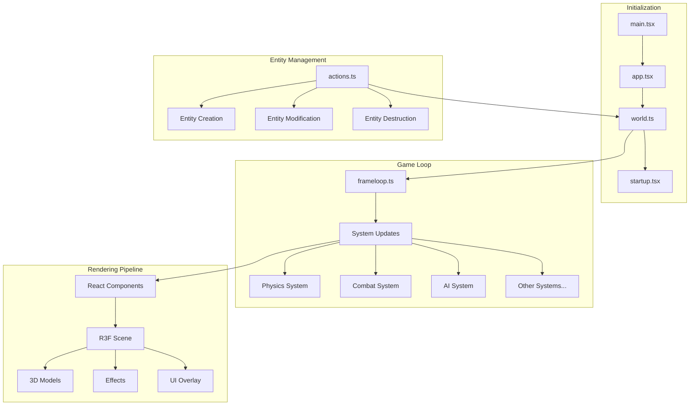
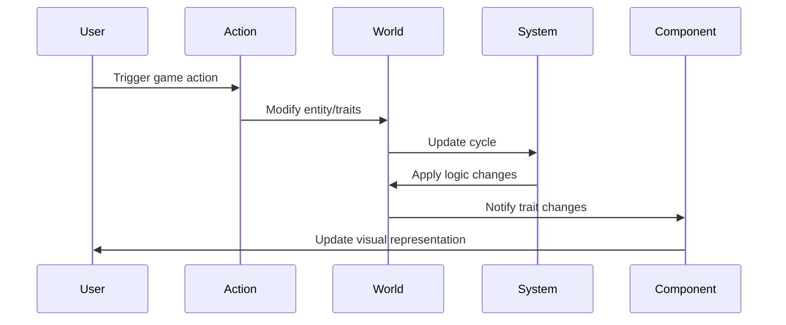

# Viber3D SpaceWars Project Structure

This document outlines the core architecture and flow of the Viber3D SpaceWars project.

## Architecture Overview

The project combines React Three Fiber (R3F) for 3D rendering with Koota ECS for game logic. This separation ensures clean architecture where:
- React components handle purely visual aspects
- ECS systems manage game logic and state
- Traits (ECS components) store entity data
- Actions provide a centralized way to modify the game state

## Core Components

1. **Game Loop**
   - Manages the main update cycle
   - Executes ECS systems in order
   - Handles timing and delta time

2. **World**
   - Contains all entities and their traits
   - Manages entity lifecycle
   - Provides query capabilities for systems

3. **Systems**
   - Pure functions that operate on entities
   - Update game logic based on traits
   - Run in a predetermined order each frame

4. **Traits**
   - Data containers for entities
   - Define entity capabilities and state
   - Used by systems for logic and by components for rendering

5. **React Components**
   - Handle 3D rendering using R3F
   - Subscribe to trait changes
   - Purely presentational, no game logic

## System Flow Diagram

## Data Flow

## Key Interactions

1. User input triggers actions
2. Actions modify the ECS world state
3. Systems process the changes during the game loop
4. React components reflect the updated state visually
5. The cycle continues with new input or autonomous systems

## Best Practices

1. Keep React components purely presentational
2. Handle all game logic in systems
3. Use actions for state modifications
4. Keep traits minimal and focused
5. Maintain clear separation between ECS and React 